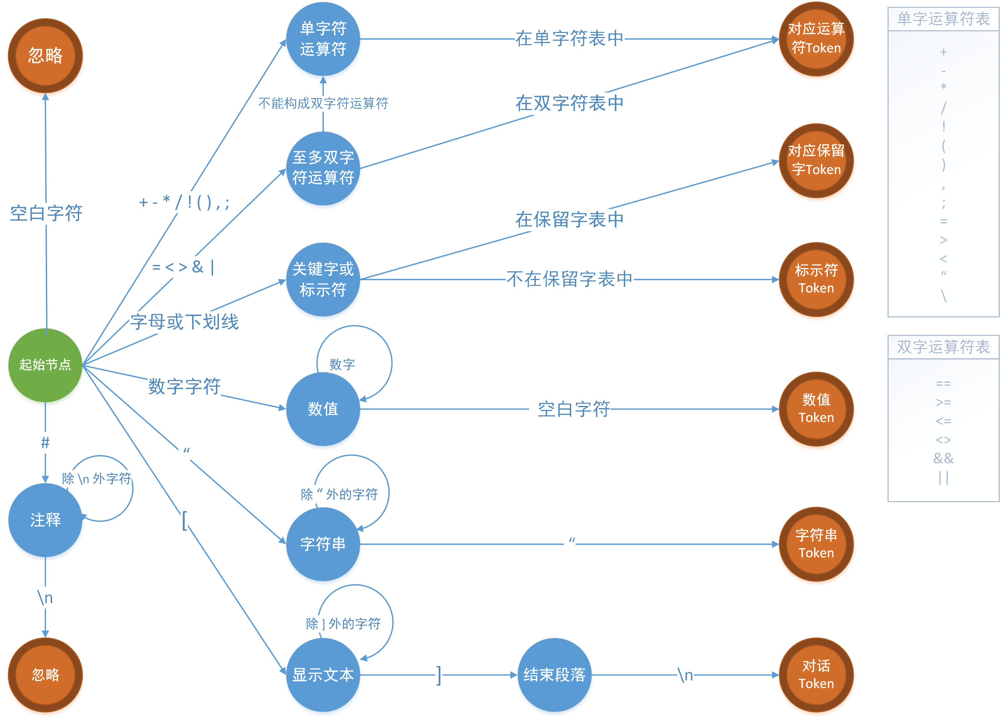

## 词法分析

对给定的以**UTF-8**编码的Yuriri脚本文件，词法分析器将分析文件中的所有语句，对单词进行识别并产生一个包含了单词信息和类型的数据结构，称之为**Token**。将识别出的所有Token全部放入一个有序的Token流中，Token流将交由后续的语法分析器去继续处理。<br/>
脚本的词法分析问题，实际上是一个识别和解析字符串的模式匹配问题，可以用确定性有穷自动机（**DFA**）模型来实现。DFA是一个能实现状态转移的自动机，对于一个给定的属于该自动机的状态和一个属于该自动机字母表**Σ**的字符，它能根据事先给定的状态转移方程转移到某一个状态。DFA逐个扫描脚本字符，并根据给定的状态转移表到达下一状态。在读完该字符串后，如果自动机停在一个接受状态，那么它就接受该字符串，反之则拒绝该字符串。<br/>
在词法分析过程中，采用忽略空白字符（**\r**, **\t**, **\n**, **空格**）的**最长匹配**原则，当输入的多个前缀与一个或多个模式匹配时，采用以下规则解决冲突：

> ① 总是选择最长的前缀。比如，扫描到字符“<”时，会向字符流的前面再看一个字符，看是否能匹配为更长的“<=”或“<>”，若可以，则匹配为“<=”或“<>”，而不是“<”。<br/>
> ② 如果最长的可能前缀与多个模式匹配，总是优先匹配保留字表中的元素。比如，“return”不会被作为标识符处理，而是被匹配为保留字。

在以上的约束下，Yuriri脚本的词法分析确定性有穷状态机示意图如图所示：



Yuriri句子：
```
@var name="$myvar" dash=1024+512
```
通过词法分析后将产生一个Token流对象，其内容形如：

| Line | Column | Type | Code | Tag |
| :------- | :------- | :------- | :------- | :------- |
| 0 | 0 | operator_at | @ | null |
| 0 | 1 | command_var | var | null |
| 0 | 5 | parameter_name | name | null |
| 0 | 9 | operator_equal | = | null |
| 0 | 10 | id | "$myvar" | \$myvar(string) |
| 0 | 19 | parameter_dash | dash | null |
| 0 | 23 | operator_equal | = | null |
| 0 | 24 | number | 1024 | 1024(double) |
| 0 | 28 | operator_plus | + | null |
| 0 | 29 | number | 512 | 512(double) |

词法分析器利用DFA，将输入缓冲中的源代码行数据不断地解析成Token流，与此同时为编译器生成的错误消息与源代码的位置进行关联，例如，词法分析器会为每个Token赋予它在源代码中被命中时的位置戳（行号、列号）和具体的内容。随后，词法分析器将把生成的Token流返回，由语法分析器去继续进行编译工作。
