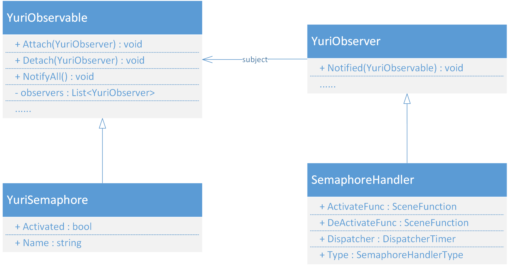

## 信号分发机制
并行调度机制为YRE提供了一种并发的能力，但对于一些应用场景，这种策略显然不是一个明智的选择。例如当按下键盘上某个键的时候，屏幕上显示一张图片，松开时图片消失，虽然并行处理也可以做到，但它的实现方式相当于**轮询**，在这个应用场景下存在效率问题。因此，对于IO响应这些场景，YRE提供了信号分发机制以解决这一问题。 
信号分发机制有两个组成部分：信号量和（反）激活函数：

- 信号量（Semaphore）：运行时环境中的一个信号标记，它只有两种状态：激活、熄灭。当某些条件被满足时，该信号会从熄灭变成激活。请注意这个概念与操作系统中的信号量不一致。
- 激活函数（Activator）：当信号量被激活时，它就会执行绑定在它上面的激活函数，激活函数与普通的场景函数没有区别
- 反激活函数（Deactivator）：与激活函数类似，只是它触发的时机是信号量熄灭时

一个信号量可以绑定多个（反）激活函数，一个（反）激活函数也可以被绑定到多个信号量上。

### 体系结构
信号分发系统是采用**观察者模式**进行实现的。YRE中提供了两种基础观察者模式抽象类：订阅号抽象类`YuriObservable`和订阅者抽象类`YuriObserver`。 
订阅号抽象类提供这些服务：

| 函数或属性名 | 作用 |
| :-------- | :-------- |
| Attach | 将订阅者加入订阅号的通知列表 |
| Detach | 将订阅者从订阅号的通知列表中移除 |
| ClearObserver | 清空所有的订阅者 |
| NotifyAll | 广播更新通知 |
| NotifyGroup | 将更新通知分发给指定Group的订阅者 |
| Notify | 将更新通知分发给指定Tag的订阅者 |
| ObservableTag  | 订阅号的附加值 |
| UpdateInfo | 获取最后一次更新的附加信息 |

订阅者抽象类提供这些服务：

| 函数或属性名 | 作用 |
| :-------- | :-------- |
| Notified | 被订阅者通知更新时执行的动作 |
| ObGroup | 订阅者的分组名 |
| ObserverTag | 订阅者的附加值 |

YRE中的可订阅对象和订阅者对象都继承这两个抽象类。在信号分发机制中，可订阅对象是`YuriSemaphore`，订阅者是`SemaphoreHandler`。 
信号量对象`YuriSemaphore`的每一个实例代表某一个命名信号量，它的激活属性`Activated`在发生改变时会通知所有订阅该信号量的信号量处理器`SemaphoreHandler`执行对应的动作：在`Activated`被变更为激活时，执行**激活函数**；在`Activated`被熄灭时，执行**反激活函数**。在信号分发系统中，类的层次关系如图：

信号量处理器`SemaphoreHandler`有一个字段`Type`来标记它使用怎样的执行方式去调度信号的激活函数，目前YRE支持这几种调度类型：

- **ScheduleOnce**：在信号改变时执行一次激活函数
- **ScheduleForever**：在信号被激活时循环执行激活函数直到函数主动退出并执行一次反激活函数
- **ScheduleWhenActivated**：在信号被激活时循环执行处理函数直到信号被熄灭被执行一次反激活函数

注意到反激活函数总是**只会被执行一次**。

### 信号量分发器
YRE维护着一个全局静态的信号量分发器`SemaphoreDispatcher`，为游戏提供信号量分发服务。它所提供的方法如下：

| 函数或属性名 | 作用 |
| :-------- | :-------- |
| Schedule | 调度一个信号处理机，这是`SemaphoreHandler`被`YuriSemaphore`通知更新并调用`Notified`方法后会调用的函数 |
| ReBinding | 注销现有的信号处理机并依照字典重绑定信号与处理机，用于读档和回滚 |
| RegisterSemaphoreService | 为当前场景注册某个信号的调度服务 |
| UnregisterSemaphoreService | 为当前场景注销所有信号的调度服务 |
| SetSemaphore | 添加一个信号量 |
| RemoveSemaphore | 移除一个信号量 |
| Activate | 激活一个命名信号量，如果信号量不存在，将被初始化并激活 |
| Deactivate | 熄灭一个命名信号量 |
| DeactivateAll | 熄灭所有的信号量 |
| AbortHandlerGroup | 停止分组中的所有信号处理机并销毁 |
| AbortHandlerAll | 停止所有的信号处理机并销毁 |
| InitSystemSemaphore | 初始化系统默认信号量 |
| EnableDispatcher | 获取或设置是否启用信号调度服务 |

进行信号调度的本质和并行处理是一样的，都是使用一个并行执行器`ParallelExecutor`封装一个栈机和优先度时钟去进行消息循环，区别在于信号系统消息循环在处理函数的脚本执行完之后的动作根据信号处理器的类型会有区别。 

### 信号量的使用
在Yuriri脚本中，使用`@semaphore`指令可以操作信号量分发器。通常来说，在场景中使用该指令绑定要监听的信号量和相应的函数，来达到所需的效果。 
本节开头所述的按下键盘按钮显示图片松开时消失的需求，使用信号系统可以很方便的完成：首先书写两个函数，一个显示图片，一个消去图片，并把它们分别作为激活函数和反激活函数绑定到指定的键盘按键的信号量上（键盘输入是一个系统信号量，由YRE负责激活和熄灭，无需用户操作），这样就实现了需求功能。
