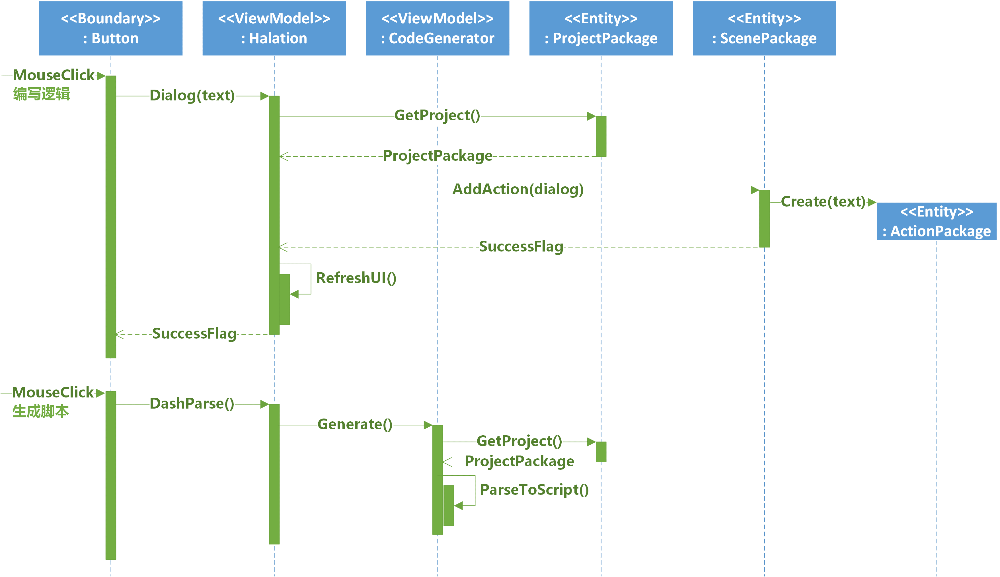

## 布局信息的存储
Yuri AVG Engine的可视化开发环境Halation包含以下几个功能：使用图形化界面编写游戏场景和函数逻辑、管理游戏的图像和音频资源、对游戏资源进行封包、调试游戏并查看调试信息。这一系列的图形化操作背后都需要布局信息来支持它。 

### 可视化脚本
考虑图形化界面编程中的数据存储方式，Halation维护着一个集合，它包含了每一个场景或函数的可视化包装，这个包装中使用线性表有序地保存了用户在GUI上编写的游戏逻辑，它的数据结构类似于<**命令类型**，**参数字典**>。 
采用线性表结构的原因是，表的下标自然成为了该命令所在的行号，这对调试过程中调试信息的输出来说非常方便。在可视化界面中经常会用到对整个连续代码段的剪切、复制、粘贴和删除这些动作，线性表容器使得这种操作可以被很好地支持。

### 全局设置
Halation提供了自定义游戏设置的面板，开发者可以通过面板来设置自己游戏的基本属性，如分辨率、默认字体和字号等。当用户完成设置的更改后，Halation会将这些设置信息保存为一个设置包装`ConfigPackage`，它会在生成游戏工程时被作为一个结构化ASCII文件储存到游戏根目录下，供YRE读取并应用这些设置。设置存储交换文件采用如下的结构来储存数据：

> ConfigItemName => ConfigItemValue

其中`ConfigItemName`是设置项的名称`ConfigItemValue`是设置项的常数值，`=>`是分隔符，YRE中的`ConfigParser`会依照这个格式来解析设置文件，并使用这个设定来呈现游戏内容。

### 一个可视化编写的后台技术逻辑例子
可视化开发环境Halation在可视化游戏逻辑编写也拥有大量的具体用例，他们和YRE中的游戏逻辑用例有一一对应的关系，限制于篇幅也无法一一做详细介绍，因此本小节选择最常用的“显示文本”命令为例，展示Halation是如何实现可视化游戏逻辑编写、储存以及脚本生成的。

从编写显示对话这一用例的顺序图上可以看到，用户通过与前端的控件交互，View层的控件将收集到的信息发送给控制器类Halation，如显示对话将会调用Halation的`Dialog`方法并将要显示的文本作为`text`参数，Halation将会获取当前的工程包装`ProjectPackage`并通过命令模式为这一用户命令建立一个可视化动作包装`ActionPackage`并插入到当前活动的场景`ScenePackage`的可视化代码中。最后，Halation会调用刷新UI的相关方法来更新View层，使用户看到自己插入的命令出现在了可视化游戏逻辑编辑器中的合适位置。
	再考虑常用的脚本生成核心用例的架构实现。用户在前端要求将可视化游戏逻辑生成为Yuri Script脚本时，View层控件请求控制器类Halation执行`DashParse`方法来将当前工程翻译，控制器会调用脚本生成器`CodeGenerator`的`ParseToScript`方法来翻译当前工程。
